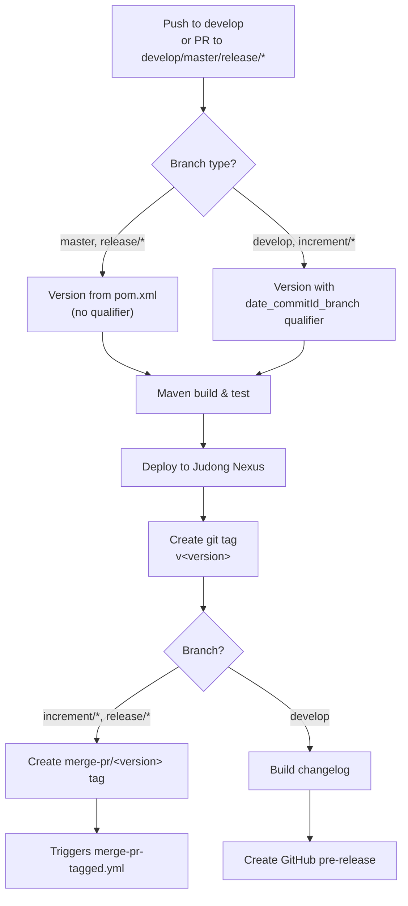

# Development Version and Branch Handling

This document describes the GitFlow-based branching strategy, version numbering policy, and CI/CD pipeline for the Java Embedded Compiler project.

## Branches

The project uses a [GitFlow](https://www.atlassian.com/git/tutorials/comparing-workflows/gitflow-workflow) branching model. Each branch type serves a specific purpose in the release lifecycle:

| Branch Pattern | Base | Purpose |
|----------------|------|---------|
| `develop` | — | Main development branch. Contains the latest sources for the current active version. |
| `feature/JNG-NUMBER_summary` | `develop` | New features for the next release. |
| `release/X.Y.Z` | `develop` | Stabilization branch for a specific release. The `release/` prefix is reserved for CI. |
| `bugfix/JNG-NUMBER_summary` | release branch | Bug fixes applied during release testing. Must also be applied to newer release and develop branches. |
| `support/JNG-NUMBER_summary` | release branch | Minor changes to a previous release; merged back to the release branch on update. |
| `hotfix/JNG-NUMBER_summary` | `master` | Critical fixes applied to both release and master branches. |
| `master` | — | Latest released (stable) sources of the active version. |

### Branch Flow Diagram

```mermaid
gitGraph
    commit id: "init"
    branch develop order: 1
    checkout develop
    commit id: "dev-1"
    branch feature/JNG-1 order: 2
    commit id: "feat-1"
    commit id: "feat-2"
    checkout develop
    merge feature/JNG-1 id: "merge-feat-1"
    branch feature/JNG-3 order: 3
    commit id: "feat-3"
    checkout develop
    merge feature/JNG-3 id: "merge-feat-3"
    branch release/1.0-beta1 order: 4
    commit id: "rc-1"
    branch bugfix/JNG-4 order: 5
    commit id: "fix-1"
    checkout release/1.0-beta1
    merge bugfix/JNG-4 id: "merge-fix"
    checkout develop
    merge release/1.0-beta1 id: "merge-release"
    checkout master
    merge release/1.0-beta1 id: "release-1.0"
```

## Version Numbers

Versions follow semantic versioning with these rules:

| Event | Version Change |
|-------|---------------|
| Starting a feature branch | No change — inherits from `develop` |
| Starting a release branch | 2nd number on `develop` is incremented |
| Bugfix branch (on release) | No change — fixes are applied before release |
| Support branch | 3rd number is incremented |
| Hotfix branch | 4th number is incremented |

### Qualified Versions

For non-release branches, the CI appends a qualifier to the version:

```
<major>.<minor>.<qualifier>.<date>_<commitId>_<branchName>
```

For release branches (`master`, `release/*`), the version is used as-is from `pom.xml` (without `-SNAPSHOT`).

## GitHub Actions Workflows

The CI/CD pipeline consists of several interconnected GitHub Actions workflows:

### build.yml — Primary Build Pipeline



### merge-pr-tagged.yml — Merge Automation

Triggered when a `merge-pr/*` tag is pushed. Routes merges based on version format:

- **`major.minor.qualifier`** format → merge PR to `master`, triggers `create-release-on-master.yml`
- **Qualified version** → squash PR to `develop`, triggers `build.yml`

After processing, the `merge-pr/*` tag is deleted.

### create-release-on-master.yml — Release Publication

Triggered by pushes to `master`. Builds a changelog and creates a GitHub release marked as the latest stable release.

### release.yml — Manual Release Trigger

Manually triggered with a version parameter (`auto` or explicit `major.minor.qualifier`):

1. Creates a PR to `master` with the release version
2. Creates a PR to `develop` with the next (qualifier + 1) version
3. Both PRs trigger `build.yml`

### Other Workflows

| Workflow | Purpose |
|----------|---------|
| `bump-version.yml` | Version bumping automation |
| `delete-old-draft-releases.yml` | Cleanup stale draft GitHub releases |
| `build-dependabot.yml` | Separate build validation for Dependabot PRs |
| `jira-description-to-pr.yml` | Copies JIRA ticket descriptions into PR bodies |

## Development Rules

> **Important:** There is no commit without a ticket number. Every commit and pull request must reference a JIRA ticket in the format `JNG-xxx`.

Issue tracking is managed in [JIRA](https://blackbelt.atlassian.net/jira/dashboards).
