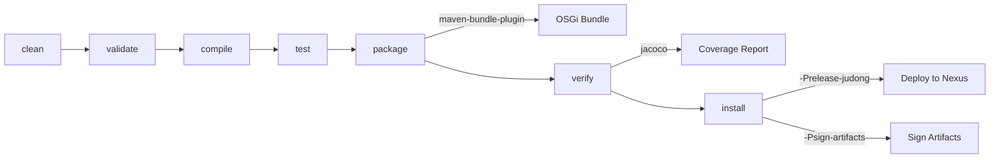

# Contributing to Java Embedded Compiler

This guide covers everything you need to get a working development environment, understand the project structure, and submit changes.

## Development Environment

### Required Tools

| Tool | Version | Notes |
|------|---------|-------|
| **JDK** | 11+ | [Azul Zulu JDK 11](https://www.azul.com/downloads/?version=java-11-lts&package=jdk) recommended. The CI uses JDK 21 to run the build, but source/target compatibility is Java 11. |
| **Maven** | 3.9.4+ | A Maven wrapper (`mvnw` / `mvnw.cmd`) is included in the repository — prefer using it over a system-installed Maven. |

Verify your setup:

```bash
java -version
# Expected: openjdk version "11.x.x" (or higher)

./mvnw -version
# Expected: Apache Maven 3.9.4+
```

### JVM Configuration

The project ships a `.mvn/jvm.config` that automatically applies these JVM flags during the Maven build:

- `-Xms1024m -Xmx2048m` — heap sizing for compilation-heavy builds
- `--add-opens` flags for `java.base/java.lang`, `java.base/java.util`, `java.base/java.time` — required for JDK 9+ module system compatibility

You do not need to set these manually; Maven picks them up automatically.

## Build Commands

```bash
# Full build (compile + test + package + install locally)
./mvnw clean install

# Run tests only
./mvnw clean test

# Build without sub-modules (parent POM only)
./mvnw clean install -DskipModules=true

# Skip tests
./mvnw clean install -DskipTests

# Run a specific integration test
./mvnw test -Dtest=CompilerUtilITest -f java-embedded-compiler-itest/pom.xml
```

### Build Lifecycle



### Maven Profiles

| Profile | Purpose |
|---------|---------|
| `modules` | Active by default. Includes all sub-modules. Disable with `-DskipModules=true`. |
| `sign-artifacts` | GPG-sign artifacts for Maven Central release. |
| `release-dummy` | Deploy to a local `/tmp/` directory (for testing the release process). |
| `release-judong` | Deploy to the Judong Nexus snapshot repository. |
| `release-central` | Deploy to Maven Central via Sonatype OSSRH. |
| `generate-github-asciidoc-diagrams` | Render PlantUML diagrams from `.github/` AsciiDoc files. |
| `update-source-code-license` | Update Apache 2.0 license headers in source files. |

## Project Structure

```
java-embedded-compiler/
├── java-embedded-compiler/          # Core API module
│   └── src/main/java/.../api/
│       ├── CompilerContext.java      # Builder for compilation config
│       ├── CompilerFactory.java      # Strategy interface for compilers
│       ├── CompilerUtil.java         # Main compilation entry point
│       ├── classloader/              # CompositeClassLoader, CompiledJavaFileObjectsClassLoader
│       ├── filemanager/              # InMemory, OutputDirectory, OSGi, CustomClassLoader managers
│       ├── fileobject/               # JavaFileObjects factory, Memory/ClassFile/OSGi file objects
│       └── exception/                # CompileException with diagnostics
├── java-embedded-compiler-jdt/      # JDK system compiler (ToolProvider)
├── java-embedded-compiler-ecj/      # Eclipse ECJ compiler
├── java-embedded-compiler-osgi/     # OSGi CompilerService (DS component)
├── java-embedded-compiler-itest/    # Karaf + Pax Exam integration tests
└── java-embedded-compiler-reports/  # JaCoCo aggregate coverage
```

## Submission Guidelines

### Submitting an Issue

Before filing a new issue, search the [issue tracker](https://github.com/BlackBeltTechnology/java-embedded-compiler/issues) for existing reports. When filing, include:

- Output of `java -version` and `mvn -version`
- Relevant `pom.xml` or `.flattened-pom.xml` content
- A minimal reproduction case

### Submitting a Pull Request

This project follows [GitHub's standard forking model](https://guides.github.com/activities/forking/). Fork the repository and submit pull requests against the `develop` branch.

> **Important:** Every commit must reference a JIRA ticket number (e.g. `JNG-xxx`). There is no commit without a ticket number.

For full CI/CD workflow details, see [CIFLOW.md](.github/CIFLOW.md).
