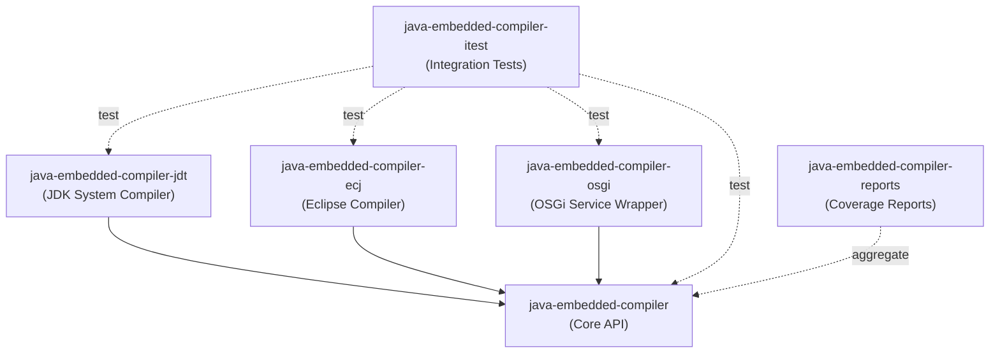
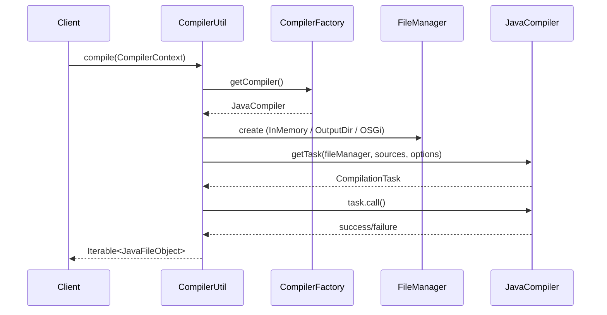
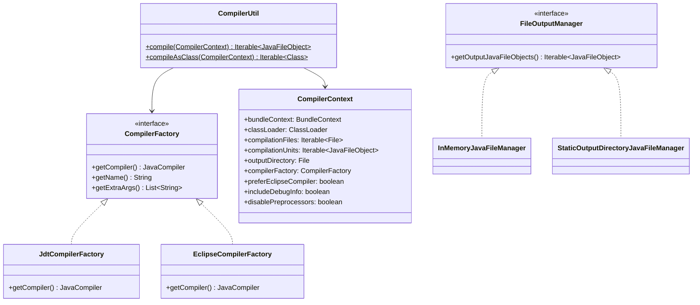
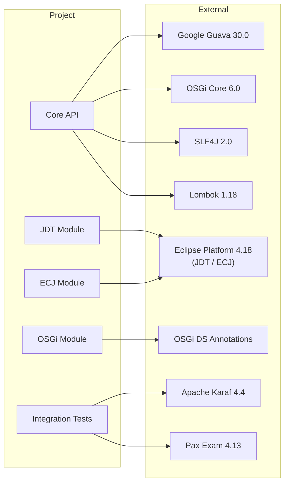

# Java Embedded Compiler

[](https://github.com/BlackBeltTechnology/java-embedded-compiler/actions/workflows/build.yml)

## Introduction

Java Embedded Compiler is a library that enables on-the-fly Java source compilation and class loading in both standard Java and OSGi environments. It provides a unified API over two pluggable compiler backends — the JDK system compiler (javac via `ToolProvider`) and the Eclipse Compiler for Java (ECJ) — so that application code can compile Java sources at runtime without being coupled to a specific compiler implementation.

Typical use cases include dynamic code generation, runtime model transformations, and hot-deploying compiled classes inside an OSGi container such as Apache Karaf.

## Module Overview

The project is a multi-module Maven build consisting of six modules that layer on top of each other:



| Module | Purpose |
|--------|---------|
| `java-embedded-compiler` | Core API: `CompilerContext`, `CompilerUtil`, file managers, classloaders, and file objects |
| `java-embedded-compiler-jdt` | `JdtCompilerFactory` — wraps the JDK system compiler (`ToolProvider.getSystemJavaCompiler()`) |
| `java-embedded-compiler-ecj` | `EclipseCompilerFactory` — wraps the Eclipse ECJ compiler with a custom compilation task wrapper |
| `java-embedded-compiler-osgi` | `CompilerService` — an OSGi Declarative Services component that dynamically discovers and ranks compiler factories |
| `java-embedded-compiler-itest` | Karaf + Pax Exam integration tests that exercise all compilation modes in a real OSGi container |
| `java-embedded-compiler-reports` | JaCoCo coverage aggregation across modules |

## Architecture

### Compilation Flow

The main entry point is `CompilerUtil.compile()`, which orchestrates the full compilation pipeline:



### Class Diagram — Key Public APIs



### Dependency Graph



## Quick Start

```java
// In-memory compilation from source string
CompilerContext context = CompilerContext.builder()
    .compilationUnits(ImmutableList.of(
        JavaFileObjects.forSourceString("com.example.Hello",
            "package com.example; public class Hello { }")
    ))
    .build();

Iterable<JavaFileObject> compiled = CompilerUtil.compile(context);

// Compile and load classes directly
Iterable<Class> classes = CompilerUtil.compileAsClass(context);
```

## Contributing

See [CONTRIBUTING.md](CONTRIBUTING.md) for development setup, submission guidelines, and CI workflow details.

## License

This project is licensed under the [Apache License 2.0](https://www.apache.org/licenses/LICENSE-2.0).
